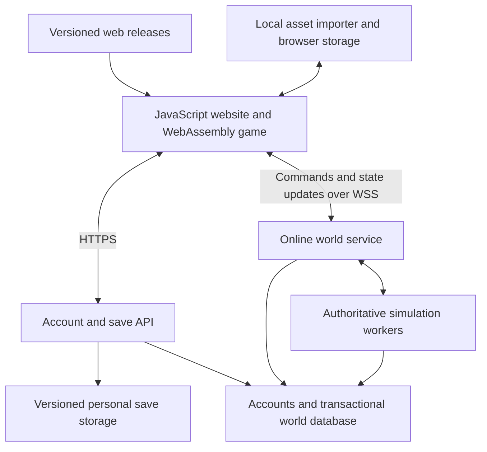

# eZeus browser game and shared online world — development plan

Version 0.1 · September 19, 2026 · Planning baseline. Implementation updates: [current status](docs/STATUS.md).

**Goal:** let people create accounts, play their own Zeus/Poseidon cities in a browser, preserve their progress, and eventually participate in a larger shared world. Preserve the earlier goal of designing and validating compact, fully serviced elite housing blocks.

**Chosen direction:** adapt the eZeus C++ engine for WebAssembly, build the website in JavaScript, and add remote services for accounts, saves, updates, and multiplayer. Browser compatibility and the server simulation remain unproven. This document defines the work and its acceptance gates; it does not claim those features exist.

The recommended first online format is separate player cities connected through a shared strategic map. That format, combat rules, offline progression, and hosting choices are proposed defaults for later decisions. A continuous shared construction map would require a separate scope and performance review.

## 1. Starting point (snapshot before implementation)

| Item | Actual status |
| --- | --- |
| Original-game city research and copyable layout | Complete as a design artifact: [CityBlueprint](city-blueprint/README.md), standalone HTML, PDF, SVG, PNG, CSV, and JSON. Geometry/browser checks passed; no in-game endurance test yet. |
| eZeus release and matching source | Downloaded and verified: `0.8.2-beta.4`, commit `474a96206278293dbd9cde6d506b5570934f8acf`. Base package and latest executable extracted. |
| Core source review | Completed for the systems documented in [SOURCE_GUIDE.md](SOURCE_GUIDE.md). Not a full engine audit. |
| Asset setup | Original Steam files are available; release graphics packs are extracted. Text conversion and a verified runtime asset layout remain to be done. |
| Native build/run | Not completed. The packaged executable and converter are Windows programs; the development machine is an Intel Mac. |
| Browser port, accounts, cloud saves, remote world | Not implemented. |
| Source modifications | Release checkout is clean. Keep it as the reference and develop in a separate checkout/worktree. |

Download provenance is recorded in [upstream provenance](provenance.json). The earlier city layout targets the original engine and must not be labeled eZeus-validated without recalculation and simulation.

## 2. Product boundaries

**Client presentation (user requirement, September 19):** the game occupies the browser page. Preserve its own menus and controls; do not surround it with a website header, explanatory copy, navigation, or launch buttons. Show a byte-based asset progress bar during startup, then hide it when the game renders. The game viewport must follow the browser window's shape without stretching the artwork or restarting the city. Main-menu backgrounds must cover that same viewport, retaining the original artwork and game controls through the roster and settings screens. Use a bounded rendering resolution to avoid unnecessary Retina/4K rendering cost. Future account and save interfaces must fit within the game client.

| Mode | What the player gets | Where authoritative progress lives |
| --- | --- | --- |
| Personal single-player | A private browser game, normal pause/speed controls, local saves, and optional account synchronization | Browser during play; versioned personal saves in cloud storage |
| Shared online world | A private city belonging to an account, other player cities on a world map, trade, and later diplomacy/conflict | Server simulation and transactional world state |
| City design tools | Copyable layouts, service/appeal overlays, validation, and eventually build previews/imports | Design files; actual game placement must pass the applicable engine/server rules |

An account does not require a permanently running virtual machine. The personal game runs on the player's device. Online worlds do require server computation for authoritative simulation and persistence, even though they do not require video encoding/streaming.

**No unrestricted personal-save imports into an online economy.** Personal saves may contain offline changes, cheats, or modified rules. Online cities start from a server-issued template; only a specifically designed and validated migration could change that later. Blueprint imports contain placement intentions, not free buildings, goods, or population.

Keep full JavaScript rewrites and video streaming outside the primary development path. Streaming is a fallback to reassess only if the browser port cannot meet its acceptance gate. Shared control of one city, mobile touch support, a seamless world of construction tiles, and very large public player counts are later scope decisions.

## 3. Target architecture

Proposed implementation choices, subject to the feasibility phases:

| Layer | Starting choice | Reason |
| --- | --- | --- |
| Engine | Existing C++ with an Emscripten build target | Reuse simulation and maintain a manageable upstream patch set. |
| Browser integration | JavaScript behind the full-page game canvas; TypeScript optional | Keep the game's own interface while adding storage, accounts, and networking. |
| Account/save API | Node.js with a maintained authentication solution | Keep authentication and persistence outside the engine. |
| Persistent data | PostgreSQL for relational/transactional records; object storage for save blobs and snapshots | Trade transfers need atomic records; saves need versioning and recovery. |
| Live world connection | Secure WebSockets; evaluate a framework such as Colyseus during the two-player prototype | A transport or framework assists messaging; game authority and rules still need implementation. |
| Online simulation | Prefer native C++ workers reusing the engine, with display/audio dependencies removed or adapted | Keep rules consistent without rewriting the simulation in JavaScript. Prove the headless build before committing deployment capacity. |
| Hosting | Static web hosting plus API, database, and a small worker host for the private alpha | Select providers, regions, and spending limits after measurements. Start without an orchestration cluster. |

In online mode the browser sends requests, such as placing a building or offering a trade. The server checks ownership, costs, availability, timing, and game rules, then returns accepted changes. Browser-side simulation/prediction is optional and must reconcile to server state. The server must derive production from validated state; checking only the final trade amount against a client-provided balance is insufficient.

## 4. Source constraints that shape the work

| Observed constraint | Planned response |
| --- | --- |
| `egamewidgetpaint.cpp` advances simulation inside rendering and changes behavior based on UI state | Extract an explicit simulation step and separate player/UI decisions from rendering. Preserve single-player behavior before defining online behavior. |
| Thread-pool tasks, blocking waits, and asynchronous heat/path calculations | Establish a browser-safe scheduling strategy and inspect thread ownership. Do not assume a compile flag makes the desktop loop browser-safe. |
| `eGameDir` uses executable-relative paths | Add a configurable virtual asset root and a persistent browser save path. |
| Save streams use custom binary fields and object-reference reconstruction | Audit field widths, byte order, bounds, IDs, and versioning; test native/browser round trips. Do not assume original Zeus saves or all existing eZeus saves are portable. |
| `eRand` starts from `std::random_device`; task order can affect simulation | Add controllable RNG state where needed and measure reproducibility. Do not assume deterministic lockstep between native and WebAssembly. Prefer server authority and snapshots for multiplayer. |
| `ecityid.h` defines named city/player/team slots 0–9, and `eWorldMap` lists preset maps | Introduce global account/world/city IDs with explicit mapping to engine-local IDs. Audit loops and arrays before supporting more slots or a larger custom world. |
| Constructors and simulation code reference textures, messages, and SDL types | Identify headless adapters; a server worker is a refactoring task, not an existing ready-to-run binary. |
| Original and eZeus housing/appeal rules differ | Version rule profiles and validate the city tools against the selected engine. |

See [simulation driver](dev/widgets/egamewidgetpaint.cpp), [board](dev/engine/egameboard.cpp), [identifiers](dev/engine/ecityid.h), [world map](dev/engine/eworldboard.h), [RNG](dev/erand.cpp), and [serialization](dev/fileIO/ereadstream.h).

## 5. Milestones and acceptance gates

The milestones below define the acceptance gates. Current implementation status is tracked in [current status](docs/STATUS.md) and [BACKLOG.csv](BACKLOG.csv). Relative sizes are planning judgments, not delivery dates. Estimate time and hosting cost after M1; the engine/browser/server adaptations dominate uncertainty.

### M0 — Reproducible native baseline and assets

**Outcome:** a known-working reference before porting. Size: medium. Depends on the completed source/download research.

- Establish a separate development checkout; record compiler, dependency, engine, and asset versions. Keep original saves and the release checkout intact.
- Inventory required text, graphics, fonts, audio, adventures, and sanctuary data. Convert `Zeus_Text.eng` and `Zeus_MM.eng` using a compatible converter execution environment or a verified replacement; validate the generated XML.
- Build/run a native reference on an available supported development platform. Record the actual Mac/Linux/Windows route chosen; do not execute the upstream Mac helper blindly because it rewrites source/build files.
- Prepare a small Greek and Atlantean fixture and a larger stress city, with documented expected population, resources, service states, and engine version.
- Record how player-owned assets enter development/browser builds. Review upstream code-license requirements and the distribution status of each asset before public distribution; keep unapproved commercial assets out of public bundles.

**Gate:** fresh-checkout build instructions work; a native city loads, advances, and saves/reloads; converted text displays; the required asset manifest is complete. Record reference hardware and initial performance measurements.

### M1 — WebAssembly feasibility and engine boundary

**Outcome:** demonstrate that this engine can work inside a browser. Size: large/high uncertainty. Depends on M0.

- Add an Emscripten target and verify browser builds of the required SDL components/codecs. Keep native builds working.
- Introduce lifecycle boundaries for initialize, advance, render, command submission, save/load, and shutdown. Start a headless smoke test at this boundary to expose future server blockers early.
- Adapt the main loop, input, resize, audio start, and task scheduling. Choose worker/thread topology from measurements. If threads are used, configure the required isolation headers and avoid browser-main-thread waits.
- Load assets through an explicit browser import/packaging path; report missing/corrupt files and conversion requirements. Measure initial download/import time, peak memory, and duplicate asset copies.
- Implement local persistence and explicit export/import; verify the browser filesystem flushes before reporting a durable save. Handle storage failure visibly.
- Audit save compatibility and native/WebAssembly behavior using controlled fixtures. Inspect differences rather than assuming the same seed guarantees identical results.

**Gate:** a browser loads a real city, accepts construction/input, runs walkers and housing progression, and saves/reloads after a full page restart. Complete a 30-minute interactive run without a crash or unresponsive UI on the documented reference desktop. Record memory, frame timing, asset load, and save timing. Check one Chromium browser and Firefox; test Safari and record whether it can be supported.

**Decision:** proceed only with evidence that the port can meet the measured budget. If blocked, document the specific dependency/design issue, try a bounded workaround, and reassess scope or streaming. Do not silently replace the project with a full rewrite.

### M2 — Usable browser single-player

**Outcome:** a playable browser game before account features. Size: large. Depends on M1.

- Keep the full-page game client and automatic startup. Integrate asset onboarding, loading, settings, resolution/fullscreen behavior, and error recovery into the client without surrounding website content.
- Support start/resume, local save slots, periodic autosaves, manual export/import, and preservation of the previous good save. Do not rely on a final network request when a tab closes.
- Exercise both civilizations and the relevant housing, production, culture/science, maintenance, health, disaster, and campaign paths. Expand parity coverage beyond the initial fixture.
- Define behavior for background tabs, audio focus, pause, and interrupted imports. Keep menus responsive while engine tasks run.
- Establish the supported desktop browser list and repeatable performance budgets from M1. Mobile is not an implied launch promise.

**Gate:** a fresh user can import assets, start a city, reach a representative housing upgrade, export it, close the browser, and resume without losing acknowledged progress. The supported-browser matrix and remaining engine differences are documented.

### M3 — Accounts, personal cities, and cloud saves

**Outcome:** users sign in and resume their own game on another supported device. Size: medium/large. Depends on M2.

- Add registration/sign-in/sign-out, account recovery, session handling, a city/save dashboard, and ownership checks on every save operation.
- Store versioned save blobs with owner, city, engine version, schema version, checksum, revision, and timestamps. Add backups and a tested restore path.
- Make synchronization explicit: local success, upload pending, cloud committed, or failed. Retry interrupted uploads safely.
- Resolve simultaneous tabs/devices using a single-writer lease or revision preconditions, retaining conflicting copies rather than silently overwriting them. Define deletion and save retention behavior.
- Deploy an authenticated private staging site with HTTPS, basic service monitoring, and documented configuration. Keep the game engine in the browser for this mode.

**Gate:** two accounts cannot access each other's saves; one user can resume on a second device; expired sessions, network loss, a stale upload, and recovery from an earlier revision are exercised. No save is labeled cloud-saved before the server confirms durable storage.

### M4 — Compact elite-city tools and engine validation

**Outcome:** fulfill the original city-design objective with engine-specific evidence. Size: medium/large. Can start after M1 and proceed alongside M2–M3.

- Preserve the existing original-game layout and exports. Add an explicit eZeus rule profile based on the pinned source, including equal category counts and footprint-average appeal.
- Recalculate the eight-estate design, worker housing, and shared services. Include roads/avenues/roadblocks, delivery paths, trainer-to-venue routes, employment, goods consumption, water/health for common housing, and maintenance.
- Optimize a stated objective: minimize total required land for eight stable estates/160 elite residents under a documented scenario, with worker/support footprints and external production/import assumptions reported separately. Compare alternatives; label the best tested candidate without claiming a proven global optimum.
- Add house inspection and appeal/service overlays where practical. Report the exact missing goods/services and distinguish an upgrade condition from a supporting civic service.
- Keep copyable HTML, printable PDF, SVG/PNG, CSV, and machine-readable layout exports. Add a preview/importer through engine placement APIs; validate terrain, availability, costs, unique structures, and agora assembly. Start in private sandbox mode with backup/undo behavior.
- Observe both civilizations for a full game year after reaching target housing, with resource/service cheats disabled. Exercise temporary shortages and verify recovery without chronic service starvation.

**Gate:** publish each layout with its engine/rule version, complete cost/support breakdown, validation results, and limitations. A claimed stable design must retain target housing during the defined observation period. Original Zeus and eZeus results are labeled separately; only the actually tested engine receives an in-game validation claim.

### M5 — Server-authoritative simulation and online foundations

**Outcome:** trustworthy online city state. Size: very large/high uncertainty. Depends on M1's boundary work and M3's account identities; investigate the worker earlier if practical.

- Implement a headless engine worker capable of loading a template, processing validated commands, advancing the chosen time model, snapshotting, and recovering. Move UI-dependent decisions behind explicit interfaces.
- Define world membership, global IDs, ownership, worker assignment, and routing. Keep engine-local IDs scoped to an instance. Measure limits before widening existing enums/containers.
- Define a versioned command protocol with authenticated identity, request ID, expected revision, payload limits, sequence/tick information, and explicit acceptance/rejection. Keep client identity claims subordinate to the authenticated session.
- Define the shared clock, disconnect/reconnect rules, offline progression, and pause/speed restrictions. Resolve these before introducing a competitive economy.
- Persist snapshots, RNG/time state needed for continuation, and committed commands/events. Implement worker ownership leases so two workers cannot advance the same city independently.
- Derive online inventories from server-controlled simulation. Add transactional transfers between the city and world economy; specify crash-safe handoff so a resource cannot exist in both places or disappear after a retry.
- Add browser snapshot/delta consumption and resynchronization. Do not trust a client-modified local save as authoritative online state.

**Gate:** server-owned cities continue/recover according to the chosen clock; duplicate, stale, unauthorized, and impossible commands are rejected; worker restarts do not repeat committed effects. A browser can disconnect and return to a consistent snapshot. Measure simulation cost per city and identify headless dependencies still needing work.

### M6 — Small shared-world multiplayer alpha

**Outcome:** two real accounts interact successfully in one persistent world. Size: large. Depends on M5.

- Create a small server-owned world map with city founding/assignment, ownership, online presence, and selected public city information.
- Connect separate browser sessions using secure WebSockets. Support initial snapshots, live updates, connection loss, and reconnect recovery.
- Implement one complete trade loop: offer, reserve goods, accept/cancel/expire, commit both sides, and report the outcome. Use transaction boundaries and idempotency to handle repeated or racing requests.
- Apply one compatible protocol/rules version per world and provide an understandable response to incompatible clients.
- Start with a cooperative economy and no hostile PvP. That is a proposed alpha default, not a final design choice for the eventual world.

**Gate:** two users found cities, see each other, and complete a server-validated trade. Repeated requests, simultaneous accepts, connection loss, and a server restart do not duplicate or lose goods. Both users reconnect to the same committed result.

### M7 — Larger world, diplomacy, and eventual conflict

**Outcome:** expand the proven multiplayer model. Size: very large; split into releases. Depends on M6.

- Replace/extend preset-map assumptions with world regions, stable coordinates, routes, ownership, and loading only relevant world data. A larger strategic map does not require rendering every city's construction map at once.
- Add player/city capacity only after auditing fixed-slot assumptions. Test capacity tiers, then set a supported limit from measurements rather than advertising an unmeasured population.
- Add alliances, diplomacy, aid, travel times, and world events with transaction and recovery behavior equivalent to trade.
- Prototype combat and territory changes only after choosing offline protection, conquest consequences, balancing, and dispute/recovery rules. Reuse existing military concepts where suitable; online outcomes must be server-resolved.
- Decide whether players can visit cities as spectators or construct together. Shared construction control remains a separate feature with permissions and concurrent-command handling.

**Gate:** the declared capacity tier meets measured tick, latency, memory, recovery, and cost budgets; alliances/aid preserve resource and ownership invariants; any combat release has documented offline and rollback behavior.

### M8 — Remote deployment, updates, and release operations

**Outcome:** a maintainable hosted service. Size: medium/large. Basic staging starts in M3; complete the following before broader release.

- Maintain separate development, staging, and production configurations. Automate builds, migrations, configuration validation, and deployment of web/API/worker components.
- Ship immutable, versioned browser/engine assets with a release manifest. Keep web shell, Wasm, data, protocol, and save schemas compatible; offer a controlled reload after saving rather than swapping a running engine underneath a city.
- Support backward-compatible save migrations or explicit refusal with preserved originals. Test rollback with the database/snapshot format, not just the website files.
- Monitor save failures, disconnects, worker crashes, world tick delay, memory, and failed transactions. Test database/object-store restoration and worker recovery.
- Load-test the declared active-user/world scale, select hosting regions and limits, and set a monthly budget from measured usage. Online simulation costs remain even without streaming.
- Complete the asset-provisioning and source/license release checklist started in M0. Provide onboarding, controls, known limitations, save export/recovery, and support instructions.

**Gate:** staging rehearses an upgrade, reconnect, compatible save load, rollback, and backup restore. Public capacity and supported browsers match measured results. Release artifacts and asset distribution are ready for the intended audience.

## 6. Order of work

Main sequence: **M0 → M1 → M2 → M3 → M5 → M6 → M7**. M4 branches from M1 and can progress alongside browser/account work. M8 begins with staging in M3 and matures alongside the online phases.

First implementation slice after this plan:

1. Create the separate development checkout and asset manifest.
2. Convert text, resolve runtime paths, and run a native city.
3. Establish the Emscripten build and explicit simulation-step boundary.
4. Load the same small city in a browser and complete a local save/reload.
5. Use the resulting measurements to estimate M2–M3 and the headless-worker spike.

Do not build a large account portal or reserve substantial hosting capacity before the browser gate. Keep the multiplayer command/state boundary in mind during the port so later server authority does not require another engine rewrite.

## 7. Decisions to resolve at the relevant milestone

These defaults make the plan actionable; they are not claims that the user has selected every product rule.

| Decision | Proposed default | Resolve before |
| --- | --- | --- |
| Browser/device scope | Desktop keyboard/mouse; Chromium and Firefox first; assess Safari in M1 | M2 support promise |
| Asset onboarding | User-provided local game assets with a validated manifest and conversion path | M2 onboarding; public asset distribution before M8 |
| Player city/world structure | Separate personal construction maps within a shared strategic map | M5 world schema |
| Starting world scale | Two accounts for correctness, then staged measured load tiers | M6/M7 capacity claims |
| Online progression | Prototype a server clock and measure continuous versus bounded catch-up work; final offline policy remains open | M5 economy |
| Personal-to-online saves | New server-issued online city; no direct personal-save import | M5 economy |
| Online pause/speed | Shared server time; opening a menu cannot pause everyone; personal mode retains its controls | M5 clock |
| PvP | Cooperative trade/aid first; hostile actions later | M7 combat |
| Runtime authority | Native C++ workers for online state; evaluate alternatives only after headless measurements | M5 deployment |
| Hosting/provider/budget | Small private staging deployment; choose provider and spending cap from measured requirements | Paid deployment |
| City optimizer objective | Eight stable estates with complete worker/service support and explicit external supply assumptions | M4 comparisons |

## 8. Validation and reporting

Use checks that establish behavior, not tests that merely repeat implementation. Keep evidence with engine, asset, browser, and protocol versions.

| Area | Required evidence |
| --- | --- |
| Browser port | Native/browser fixture comparisons, interactive run, memory/frame measurements, background-tab recovery, real persistent save/reload |
| Accounts/saves | Ownership isolation, device handoff, stale-write handling, expired session, interrupted upload, backup restore |
| City design | Placement/road validation plus real service/appeal/consumption simulation and the documented full-year stability run |
| Online simulation | Validated commands, restart consistency, duplicate-command behavior, snapshot resync, inventory conservation |
| Shared world | Two-account trade with race/disconnect/restart cases before larger load testing |
| Deployment | Compatible upgrade, migration, rollback, restore, and declared capacity/cost measurements |

Record each milestone as planned, in progress, blocked with a concrete cause, or accepted with linked evidence. Use the backlog's `depends_on` field for technical ordering; milestone gates still apply to release acceptance. No calendar deadline or public concurrency guarantee is set by this plan.

## 9. References

The upstream project and primary technical documentation inform the plan; architecture choices and sequencing are recommendations specific to this workspace.

- [Local source review](SOURCE_GUIDE.md), [source README](dev/README.md), [source license](dev/LICENSE.md), and [original city blueprint](city-blueprint/README.md).
- [Emscripten browser runtime](https://emscripten.org/docs/porting/emscripten-runtime-environment.html): the browser loop must return control to the browser.
- [Emscripten threads](https://emscripten.org/docs/porting/pthreads.html): threaded builds need appropriate COOP/COEP headers; a single binary cannot automatically switch between threaded and non-threaded builds. Evaluate separate builds only if needed.
- [Emscripten filesystem](https://emscripten.org/docs/porting/files/file_systems_overview.html): browser persistence must be deliberately configured; an in-memory filesystem alone does not preserve saves across reloads.
- [WebSocket API](https://developer.mozilla.org/en-US/docs/Web/API/WebSockets_API): ongoing browser/server messaging.
- [Colyseus documentation](https://docs.colyseus.io/): an optional multiplayer-service framework to evaluate, not an existing integration or a substitute for eZeus simulation authority.
