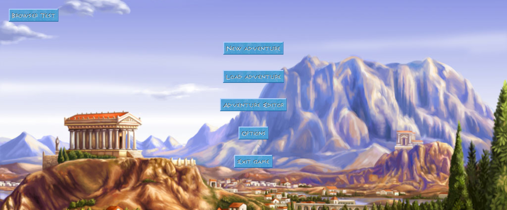
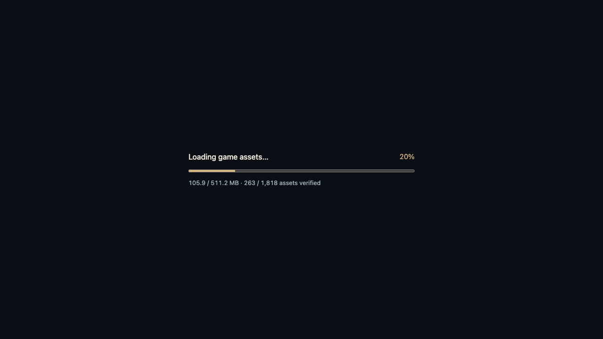
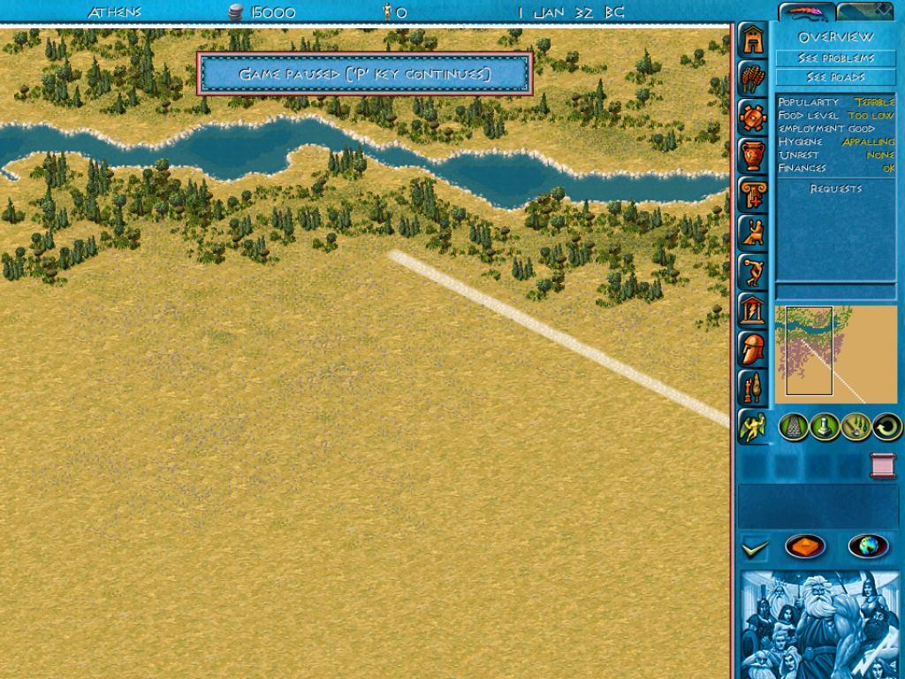
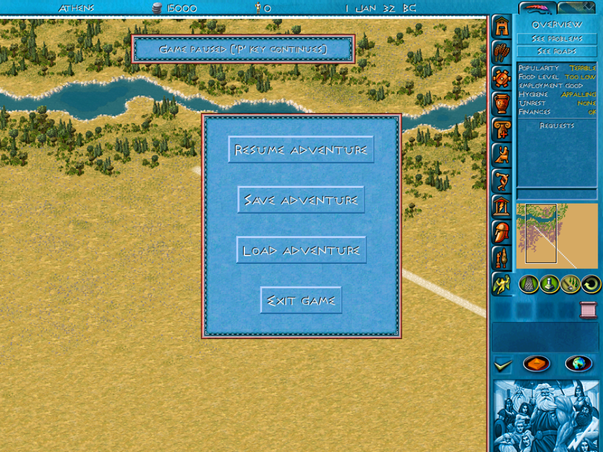

# eZeus Browser

A browser adaptation of [Maurycy Liebner's eZeus](https://github.com/MaurycyLiebner/eZeus), the C++ reimplementation of **Zeus: Master of Olympus + Poseidon**. The engine runs as WebAssembly; a small JavaScript client loads your own game assets and makes the game fill the browser window.

**Playable prototype · v0.1.0-alpha.1 · Based on upstream 0.8.2-beta.4 · GPLv3**



## Run it

1. Install **Python 3.11+** and have your own installed copy of Zeus + Poseidon available.
2. Download **`ezeus-browser-v0.1.0-alpha.1.zip`** from [Releases](https://github.com/valinux/ezeus-browser/releases/tag/v0.1.0-alpha.1). Extract it and open a terminal in its `ezeus-browser/` folder. This includes the compiled browser engine and matching source.
3. Download the upstream [eZeus 0.8.2-beta base ZIP](https://github.com/MaurycyLiebner/eZeus/releases/download/0.8.2-beta/eZeus-0.8.2-beta.zip) separately. Keep it zipped.
4. Prepare the local assets, then start the server:

```sh
python3 scripts/setup_runtime.py --game-root "/path/to/Zeus + Poseidon" --base-zip "/path/to/eZeus-0.8.2-beta.zip"
python3 scripts/serve_dev.py
```

Open **http://127.0.0.1:8787/** and keep the terminal open. On Windows use `py -3` instead of `python3`. The first load reads about **511 MB** of assets and shows progress. Create/select a leader in the game's roster, then choose **New Adventure**. Use the game's own menus and controls.

For a source checkout, compile the engine first using [BUILDING.md](BUILDING.md). GitHub's automatic “Source code” archives do not include the compiled engine. This is a local game server; accounts, public hosting, cloud saves and multiplayer are planned, not implemented.

## Included now

- Entire page is the game, with original menu artwork and controls.
- Asset loading bar with bytes, percentage and verified file count.
- Automatic viewport resizing, including portrait windows, without restarting the city.
- Reduced idle rendering, hidden-tab suspension and a one-core build optimizer default.
- Browser save storage through IndexedDB; native eZeus `.ez` loading exercised.
- [Copyable city blueprint](city-blueprint/README.md): standalone HTML, PDF, SVG, PNG, coordinates and validation. This design targets the **original game**; eZeus housing rules differ.

| Loading progress | City and game controls |
| --- | --- |
|  |  |



These are screenshots from local browser checks, not mockups. The small Athens city is a smoke test, not a demonstration of a completed elite district. Game artwork belongs to its respective owners.

## Read before playing

Original Zeus **`.sav` files are not supported** by eZeus's `.ez` loader. Renaming a file does not convert it. Native eZeus `.ez` compatibility has been smoke-tested; full campaign and repeated save/reload testing remain open.

Clearing cached images/files usually removes downloadable assets. Clearing **site data/IndexedDB** can also delete browser saves. Saves belong to a browser profile and origin, including the port; keep using the same address. There is no account backup or polished save import/export interface yet.

Scene loading can briefly flash different background pictures. The current loading widget chooses new pictures between preparation steps; this remains a known issue. The initial loading bar does not yet replace that in-game transition.

## Documentation

| Guide | Contents |
| --- | --- |
| [Setup and building](BUILDING.md) | Prerequisites, assets, source compilation, launch and troubleshooting |
| [Current status](docs/STATUS.md) | What passed, known issues, save limitations and browser coverage |
| [Architecture](docs/ARCHITECTURE.md) | Engine/client/server boundaries and storage |
| [Performance](PERFORMANCE.md) | CPU controls and bounded diagnostic commands |
| [Source guide](SOURCE_GUIDE.md) | Housing, beauty, roads, services and save format |
| [Development plan](DEVELOPMENT_PLAN.md) / [backlog](BACKLOG.csv) | Accounts, personal cities, updates, world map and multiplayer phases |
| [Release notes](CHANGELOG.md) | Versioned changes and validation |
| [Provenance](provenance.json) | Upstream source, dependency versions and asset ZIP checksum |

## Credits and licensing

The engine is primarily the work of **Maurycy Liebner and upstream contributors**, distributed under [GPLv3](LICENSE.md). This repository adds browser integration, build/runtime adjustments and project documentation. Upstream source headers and the [upstream README](dev/README.md) are retained. The ENG converter derives from Bianca van Schaik's MIT-licensed citybuilding-tools; see [third-party notices](scripts/THIRD_PARTY_NOTICES.md) and [dependency notices](docs/licenses/README.md).

Commercial game assets and personal saves are not bundled in this repository or browser release. Setup reads a locally installed game and the separately downloaded upstream runtime package. This is an unofficial project, not an official game release.
