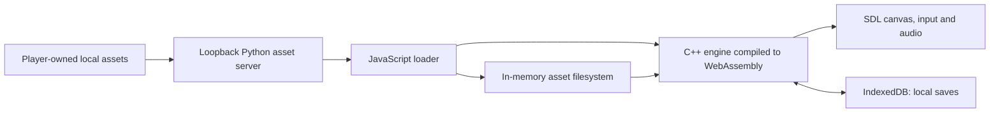

# Architecture

`dev/` contains the upstream C++17 engine and browser adaptations. SDL rendering stays on the browser thread. Asyncify yields the engine's existing loop to the browser, and worker threads handle background engine tasks. This is not yet the headless simulation worker proposed for multiplayer.

`dev/web/index.html` contains only the canvas and startup/error overlay. `app.js` fetches a hashed asset index, streams/verifies each file, populates Emscripten FS, mounts IDBFS at `/runtime/Save`, starts the engine, and forwards visibility/viewport changes. The game owns all regular menus.

`scripts/serve_dev.py` serves allowlisted engine/client files and local assets with cross-origin isolation headers. It has no login, game simulation, public asset upload, WebSocket world or database. HTTP caching stores asset responses separately from the in-memory runtime filesystem and IndexedDB saves.

Browser changes include yielding worker waits, limiting compilation optimizer cores, pausing hidden scenes, reducing idle rendering, viewport-safe widget anchoring, and scaling menu artwork to cover the page. See the [source guide](../SOURCE_GUIDE.md) for simulation, housing and resource systems.

The planned online architecture gives each player a separate city and connects cities through a server-authoritative strategic world. Shared controls on one streamed screen are not implemented multiplayer. Accounts, versioned saves, authenticated updates and world transactions require additional server work described in [the plan](../DEVELOPMENT_PLAN.md).
